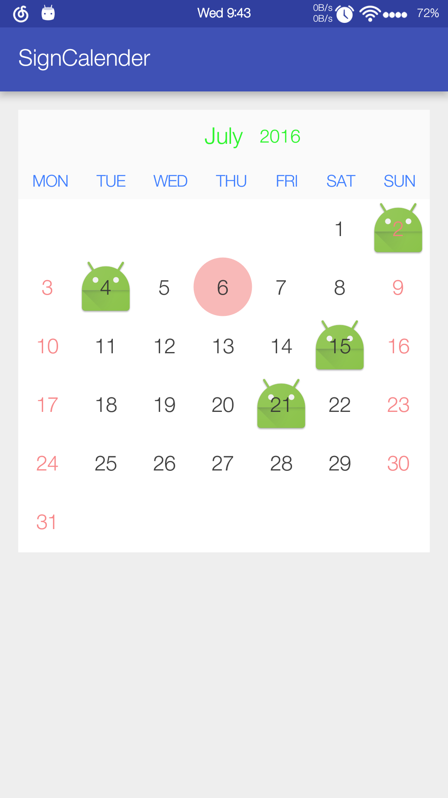

# SignCalender
## 项目中用到的一个签到日历自定义控件，基于网络源码的部分修改而成，满足自己项目的需求了。

> * 这个项目是为了练习发布依赖库;
> * 源码作者朋友如果看到后觉得不合适联系本人删掉本项目;

## 效果图

>不带任和背景修饰

>然后可以用以下代码设置背景的显示

	DatePicker2 picker = (DatePicker2) findViewById(R.id.控件id);
	picker.setFestivalDisplay(true); //是否显示节日
	picker.setHolidayDisplay(true); //是否显示假期
	picker.setDeferredDisplay(true); //是否显示补休

* 上面的背景可以根据控件对象修改。

	源码提供了左上，上，右上，左，右和背景的标识物设置。

### 传入的日期集合格式支持以下两种，更多格式可到类里面补充修改为自己需要的

	 List<String> tmp = new ArrayList<>();
	 tmp.add("2016-7-2");
	 tmp.add("2016-7-4");
	 tmp.add("2016-07-21");
	 tmp.add("2016-07-15");
	 DPCManager.getInstance().setDecorBG(tmp);

* ## 更多完整的内容可以看DEMO
*

# 怎么使用
> * 1.项目的build.gradle加入以下代码：

	 allprojects {
		 repositories {
			...
			maven { url "https://jitpack.io" }
		 }
	 }

> * 2.然后在module的build.gradle加入依赖：

	 dependencies {
			...
			compile 'com.github.paradoxie:SignCalender:0.1'

	 }

